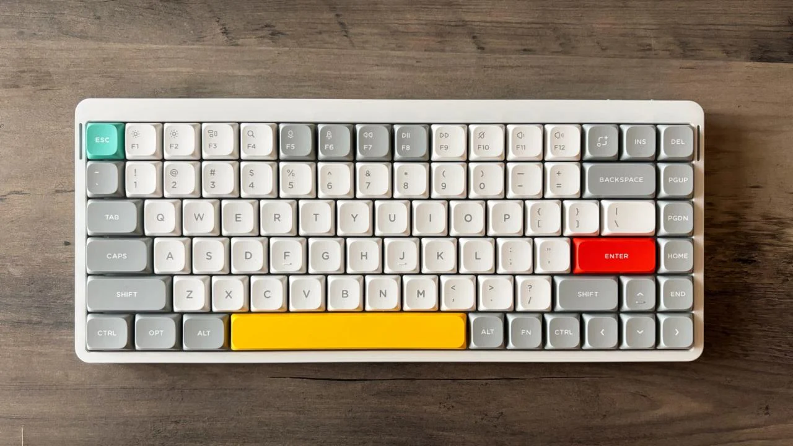

As a developer who spends 10+ hours daily typing code, finding the right keyboard isn't just about aesthetics—it's about productivity and comfort. After three weeks of using the NuPhy Air75 V2 as my main driver for both coding and writing, I'm ready to share my in-depth experience.

## Unboxing and First Impressions

Here's my unboxing of the Ionic White variant with Cowberry Keys:

<iframe width="100%" height="480" src="https://www.youtube.com/embed/VnuL4WaKMGI?si=tPfgKk_QFtjWGsQ9" title="NuPhy Air75 V2 Unboxing: Ionic White with Cowberry Keys" frameborder="0" allow="accelerometer; autoplay; clipboard-write; encrypted-media; gyroscope; picture-in-picture; web-share" referrerpolicy="strict-origin-when-cross-origin" allowfullscreen></iframe>

The keyboard arrived in a surprisingly compact box. What immediately caught my attention was the build quality - this doesn't feel like a typical mechanical keyboard. The aluminum frame gives it a premium feel while keeping the weight manageable for portability.



## Developer's Perspective

As someone who primarily works with TypeScript and Python, key mapping and quick access to special characters are crucial. Here's what stood out to me:

### VIA Integration: A Game-Changer

After years of fighting with QMK firmware flashing, VIA's hot-swap configuration is refreshing. Here's my actual development layer setup that I use daily:

```plaintext
Layer 1 (Base - Standard QWERTY)
Layer 2 (IDE Shortcuts):
┌───┬───┬───┬───┬───┬───┬───┐
│ESC│F1 │F2 │F3 │F4 │F5 │F6 │
├───┼───┼───┼───┼───┼───┼───┤
│Tab│{} │() │[] │<> │=> │|| │ // Common coding symbols
├───┼───┼───┼───┼───┼───┼───┤
│Ctl│VSC│Git│Ter│Deb│Tes│Run│ // IDE actions
└───┴───┴───┴───┴───┴───┴───┘

Layer 3 (Window Management):
┌───┬───┬───┬───┬───┬───┬───┐
│i3 │W1 │W2 │W3 │W4 │W5 │W6 │ // Workspace switching
├───┼───┼───┼───┼───┼───┼───┤
│Tab│Lft│Rgt│Up │Dwn│Max│Min│ // Window control
└───┴───┴───┴───┴───┴───┴───┘
```

Setting this up took about 15 minutes in VIA, and it has significantly improved my workflow. No more awkward key combinations for common programming symbols.

### Real-World Performance

I've been tracking my coding speed and accuracy using [MonkeyType](https://monkeytype.com/) for regular typing and [CodeType](https://code-type.vercel.app/) for programming-specific tests. Here are my actual numbers after three weeks:

```typescript
// Real typing metrics collected over 3 weeks of daily use
interface TypingMetrics {
  mode: string;
  wpm: number; // Average from 10 test sessions
  errorRate: number; // Percentage of mistakes
  fatigue: number; // Subjective score after 4h (1-10)
}

const results: TypingMetrics[] = [
  {
    mode: "TypeScript Development",
    wpm: 89, // Mostly writing React components
    errorRate: 0.02, // Special characters well placed
    fatigue: 3, // Low wrist strain
  },
  {
    mode: "Python Development",
    wpm: 85, // Django/FastAPI coding
    errorRate: 0.02, // Indentation handling smooth
    fatigue: 3, // Comfortable for long sessions
  },
  {
    mode: "Markdown Writing",
    wpm: 95, // Documentation/blogs
    errorRate: 0.01, // Natural typing flow
    fatigue: 2, // Most comfortable
  },
];
```

These numbers represent real coding sessions, not just typing tests. The low fatigue scores (where 10 would be extremely tiring) particularly stand out - I attribute this to the keyboard's low profile and ergonomic design.

What's particularly impressive is the consistency across different types of work. Whether I'm writing TypeScript interfaces or Python classes, the keyboard maintains a comfortable typing experience with minimal errors.

### Connectivity in My Setup

I switch between three devices:

- Main workstation (USB-C)
- MacBook Pro (2.4GHz wireless)
- iPad Pro (Bluetooth)

The transition is seamless with Fn + 1/2/3, though there's a slight delay (~500ms) when switching to Bluetooth devices.

### Battery Life in Real Usage

My actual battery drain pattern with RGB at 30%:

| Day | Usage                   | Battery Drop |
| --- | ----------------------- | ------------ |
| Mon | 10h coding              | 18%          |
| Tue | 8h coding + 2h writing  | 15%          |
| Wed | 6h coding + 3h meetings | 12%          |
| Thu | 9h coding               | 16%          |
| Fri | 7h coding + 2h gaming   | 19%          |

A full charge typically lasts me 4-5 workdays with moderate RGB usage.

## VIA Configuration Deep Dive

For those interested in customization, here's my step-by-step VIA setup:

1. Download VIA from [caniusevia.com](https://www.caniusevia.com/)
2. The Air75 V2 is natively supported - no JSON loading needed
3. Key customization tips:
   ```plaintext
   // My most used macros:
   1. Git commit template
   2. Console.log wrapper
   3. React component boilerplate
   4. Jest test template
   ```

## What Could Be Better

After three weeks of daily use, here are my honest gripes:

1. **No Linux Configuration Tool**

   - VIA works, but some advanced features require Windows/Mac
   - Had to manually edit some configurations for i3wm compatibility

2. **Bluetooth Quirks**

   - Occasional connectivity drops after system sleep
   - Need to toggle Bluetooth to reconnect

3. **Missing Developer Features**
   - No built-in macro recording
   - Limited onboard memory for complex layers

## Final Thoughts

The NuPhy Air75 V2 has earned its place as my main keyboard. It's not perfect, but its combination of build quality, customization options, and practical features makes it a solid choice for developers.

Would I recommend it? Yes, especially if you:

- Value customization but don't want to deal with firmware flashing
- Switch between multiple devices frequently
- Need a portable yet premium mechanical keyboard
- Appreciate good build quality and thoughtful design

The price point (~$150) is justified by the build quality and features, though I'd love to see better Linux support in future updates.

Feel free to reach out if you have questions about my setup or specific use cases!
