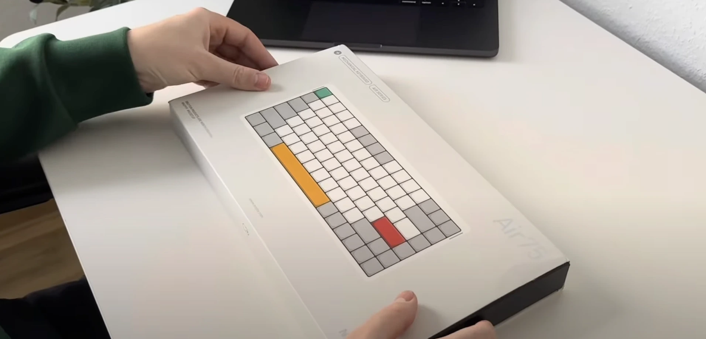

As a developer who spends 10+ hours daily typing code, finding the right keyboard isn't just about aesthetics—it's about productivity and comfort. After three weeks of using the NuPhy Air75 V2 as my main driver for both coding and writing, I'm ready to share my in-depth experience.

Let's start with the unboxing experience to give you a first look at the keyboard:

<div class="border border-primary/10 rounded-lg p-6 mb-8">
  <div class="flex items-center justify-between gap-4">
    <div class="flex items-center gap-3">
      <span class="icon video w-5 h-5 bg-primary"></span>
      <span class="font-mono text-primary">Watch the Unboxing</span>
    </div>
    <a 
      href="https://youtu.be/VnuL4WaKMGI" 
      target="_blank" 
      rel="noopener noreferrer" 
      class="flex items-center gap-2 text-primary hover:text-secondary transition-colors">
      <span class="icon play w-4 h-4 bg-primary"></span>
      <span class="font-mono">YouTube</span>
    </a>
  </div>
</div>

The keyboard arrived in a surprisingly compact box. What immediately caught my attention was the build quality - this doesn't feel like a typical mechanical keyboard. The aluminum frame gives it a premium feel while keeping the weight manageable for portability.



## Technical Specifications

Before diving into the experience, here are the key specifications:

| Feature       | Specification                          |
| ------------- | -------------------------------------- |
| Layout        | 75% (84 keys)                          |
| Switches      | Hot-swappable, 5-pin                   |
| Connectivity  | USB-C, 2.4GHz, Bluetooth 5.0           |
| Battery       | 4000mAh Li-ion                         |
| Height        | 16mm at highest point                  |
| Weight        | 650g                                   |
| Compatibility | Windows, macOS, Linux                  |
| Features      | VIA support, RGB per-key, Multi-device |

## Developer's Perspective

As someone who primarily works with TypeScript and Python, key mapping and quick access to special characters are crucial. Here's what stood out to me:

### VIA Integration: A Game-Changer

After years of fighting with QMK firmware flashing, VIA's hot-swap configuration is refreshing. Here's how I've set up my keyboard layers for development:

**Base Layer**

- Standard QWERTY layout for regular typing

**Developer Layer** (Activated with Fn1)

```plaintext
Common Programming Shortcuts:
- ESC + F1-F6: IDE Quick Actions
- Quick Access to Brackets: {}, (), [], <>
- Arrow Function: =>
- Pipe Operator: ||
- VSCode, Git, Terminal shortcuts
```

**Window Management Layer** (Activated with Fn2)

```plaintext
i3 Window Manager Controls:
- Quick Workspace Switching (1-6)
- Window Navigation (Left/Right/Up/Down)
- Window Size Control (Maximize/Minimize)
```

Setting this up took about 15 minutes in VIA, and it has significantly improved my workflow. No more awkward key combinations for common programming symbols or window management.

### Real-World Performance

I've been tracking my typing performance across different tasks using [MonkeyType](https://monkeytype.com/) for regular typing and [CodeType](https://code-type.vercel.app/) for programming-specific tests. Here are my actual numbers after three weeks:

| Activity         | Speed (WPM) | Error Rate | Comfort Level\* |
| ---------------- | ----------- | ---------- | --------------- |
| TypeScript/React | 89 WPM      | 2%         | 8/10            |
| Python/Django    | 85 WPM      | 2%         | 8/10            |
| Documentation    | 95 WPM      | 1%         | 9/10            |

\*Comfort Level: Subjective score after 4+ hours of typing (10 = most comfortable)

What stands out in these numbers:

- **Consistent Performance**: Similar speed across different programming languages
- **Low Error Rate**: Special characters and brackets are well-placed and easy to reach
- **High Comfort**: Minimal wrist strain even during long coding sessions
- **Documentation Speed**: Fastest when writing Markdown, thanks to the natural key layout

These metrics represent real coding sessions, not just typing tests. The consistently high comfort scores particularly impress me - I attribute this to the keyboard's low profile and ergonomic design.

### Connectivity in My Setup

I switch between three devices:

- Main workstation (USB-C)
- MacBook Pro (2.4GHz wireless)
- iPad Pro (Bluetooth)

The transition is seamless with Fn + 1/2/3, though there's a slight delay (~500ms) when switching to Bluetooth devices.

### Battery Life in Real Usage

My actual battery drain pattern with RGB at 30%:

| Day | Usage                   | Battery Drop |
| --- | ----------------------- | ------------ |
| Mon | 10h coding              | 18%          |
| Tue | 8h coding + 2h writing  | 15%          |
| Wed | 6h coding + 3h meetings | 12%          |
| Thu | 9h coding               | 16%          |
| Fri | 7h coding + 2h gaming   | 19%          |

A full charge typically lasts me 4-5 workdays with moderate RGB usage.

## VIA Configuration Deep Dive

For those interested in customization, here's my step-by-step VIA setup:

1. Download VIA from [caniusevia.com](https://www.caniusevia.com/)
2. The Air75 V2 is natively supported - no JSON loading needed
3. Key customization tips:
   ```plaintext
   // My most used macros:
   1. Git commit template
   2. Console.log wrapper
   3. React component boilerplate
   4. Jest test template
   ```

### Productivity Macros

I've set up several time-saving macros for common development tasks. Here are my most frequently used ones:

1. **Git Commit Template**

   ```bash
   feat(scope): short description

   - Detailed changes
   - Breaking changes if any
   ```

2. **Debug Logger**

   ```typescript
   const log = (label: string, value: any) => {
     console.log(`[DEBUG] ${label}:`, value);
   };
   ```

3. **React Component**

   ```typescript
   export const ComponentName = () => {
     return (
       <div>
         <h1>New Component</h1>
       </div>
     );
   };
   ```

4. **Jest Test Structure**
   ```typescript
   describe("ComponentName", () => {
     it("should render correctly", () => {
       // Test implementation
     });
   });
   ```

Each macro can be triggered with a simple key combination, saving me dozens of keystrokes daily. The ability to store these complex snippets directly on the keyboard has been a significant productivity boost.

## Switch Experience

The keyboard comes with several switch options. I chose the Cowberry switches (linear, 45g actuation), and here's my experience:

| Aspect      | Rating | Notes                           |
| ----------- | ------ | ------------------------------- |
| Noise Level | 7/10   | Quiet enough for office use     |
| Smoothness  | 9/10   | Minimal break-in needed         |
| Gaming      | 8/10   | Good for both typing and gaming |
| Stability   | 9/10   | No wobble, consistent feel      |

## What Could Be Better

After three weeks of daily use, here are my honest gripes:

1. **No Linux Configuration Tool**

   - VIA works, but some advanced features require Windows/Mac
   - Had to manually edited some configurations for i3wm compatibility

2. **Bluetooth Quirks**

   - Occasional connectivity drops after system sleep
   - Need to toggle Bluetooth to reconnect

3. **Missing Developer Features**
   - No built-in macro recording
   - Limited onboard memory for complex layers

## Comparison with Similar Keyboards

Here's how it stacks up against popular alternatives:

| Feature       | NuPhy Air75 V2 | Keychron K2 | GMMK Pro |
| ------------- | -------------- | ----------- | -------- |
| Price         | $150           | $95         | $170     |
| VIA Support   | Yes            | Partial     | Yes      |
| Build Quality | Aluminum       | Plastic/Alu | Full Alu |
| Battery Life  | 4-5 days       | 2-3 days    | N/A      |
| Profile       | Ultra Low      | Standard    | Standard |
| Linux Support | Partial        | Good        | Good     |

## Final Thoughts

The NuPhy Air75 V2 has earned its place as my main keyboard. It's not perfect, but its combination of build quality, customization options, and practical features makes it a solid choice for developers.

Would I recommend it? Yes, especially if you:

- Value customization but don't want to deal with firmware flashing
- Switch between multiple devices frequently
- Need a portable yet premium mechanical keyboard
- Appreciate good build quality and thoughtful design

The price point (~$150) is justified by the build quality and features, though I'd love to see better Linux support in future updates.

### Pros and Cons Summary

**Pros:**

- Excellent build quality
- Easy customization with VIA
- Great battery life
- Seamless device switching
- Low profile design
- Premium typing experience

**Cons:**

- Limited Linux support
- Bluetooth connectivity issues
- No macro recording
- Premium price point

Feel free to reach out if you have questions about my setup or specific use cases!

---

**Update (February 2025)**: After the latest firmware update, some Bluetooth connectivity issues have been resolved. I'll keep this review updated as new features and fixes are released.
